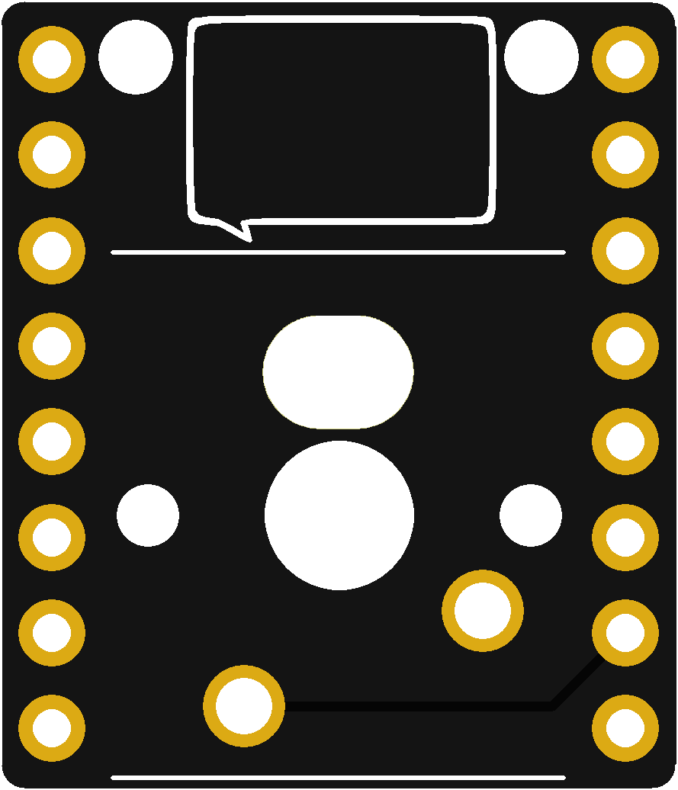
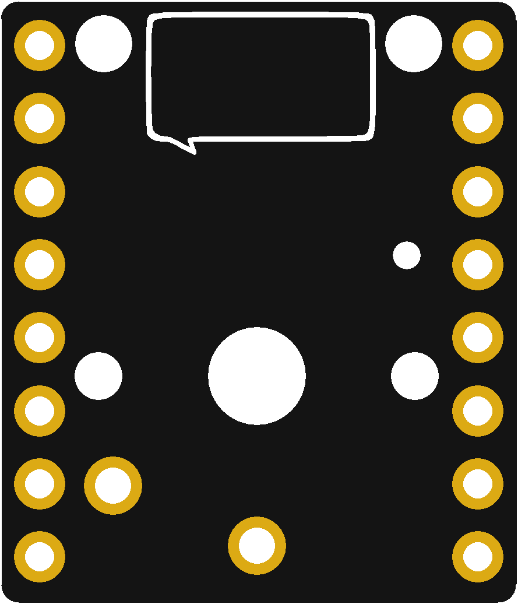

# TinyPicoKey

[Pimoroni Tiny 2040](https://shop.pimoroni.com/products/tiny-2040)に組み合わせて使用できる1キーだけのキーボード用基板です。Tiny 2040のGP6に接続されています。

## 制作環境

KiCad (6.0)

## ボード

### TinyPicoKey

Cherry MXおよび互換キースイッチ用ボードです

### TinyPicoKey-LP

Kailhロープロファイルスイッチ（PG1350）用ボードです

## 組み立て例

ピンヘッダ/ピンソケットは以下のパーツがおすすめです。

* [ロープロファイルピンヘッダ 7.7mm（低オス） 1x40（40P）](https://akizukidenshi.com/catalog/g/gC-02900/)
* [シングルピンソケット （低メス） 1x20 （20P）](https://akizukidenshi.com/catalog/g/gC-03138/)

TinyPicoKeyにピンヘッダを、Tiny 2040にピンソケットをはんだ付けすることをおすすめします。

## サンプルスクリプト

CircuitPythonで使うサンプルです。

## License

board-tinypicokey-lp/Library.pretty/SW_PG1350.kicad_mod from [daprice/keyswitches.pretty](https://github.com/daprice/keyswitches.pretty) is licensed under a [Creative Commons Attribution-ShareAlike 4.0 International License](https://creativecommons.org/licenses/by-sa/4.0/). We added a modification to remove the border line.
