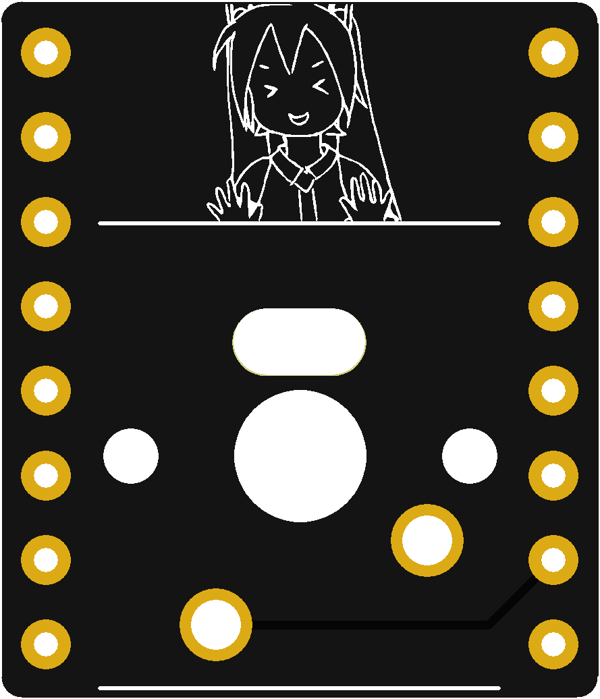
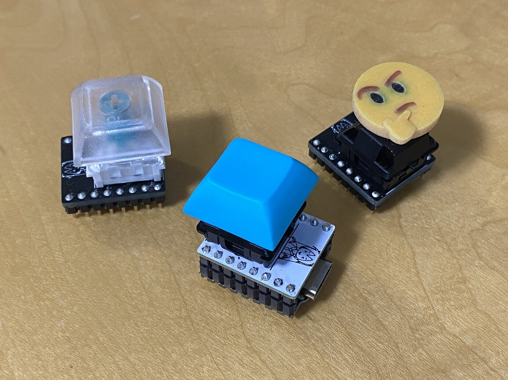

# TinyPicoKey

[Pimoroni Tiny 2040](https://shop.pimoroni.com/products/tiny-2040)に組み合わせて使用できる1キーだけのCherry MX互換キーボード用基板です。Tiny 2040のGP6に接続されています。

## 制作環境

KiCad Nightly Build (5.99)

## Issue

スルーホールが少し小さいっぽいので、ピンの差し込みが辛いかもです。次のバージョンがあったら、穴を広げます。

## 組み立て例

ピンヘッダ/ピンソケットは以下のパーツがおすすめです。

* [ロープロファイルピンヘッダ 7.7mm（低オス） 1x40（40P）](https://akizukidenshi.com/catalog/g/gC-02900/)
* [シングルピンソケット （低メス） 1x20 （20P）](https://akizukidenshi.com/catalog/g/gC-03138/)

TinyPicoKeyにピンヘッダを、Tiny 2040にピンソケットをはんだ付けすることをおすすめします。

## サンプルスクリプト

CircuitPythonで使うサンプルです。